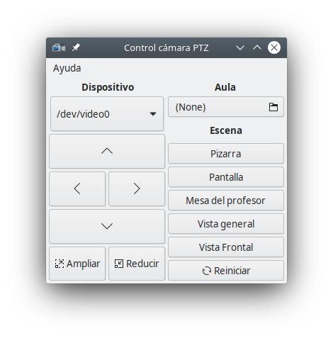

# UATPTZLinux
Programa para controlar cámaras PTZ que soporten las opciones "pan_absolute", "tilt_absolute" y "zoom_absolute" (o similares).
Está desarrollado para las cámaras que usa la Universidad de Córdoba, AVER VC520 Pro, aunque puede configurarse fácilmente para otros modelos de cámaras PTZ.

## Build

Son necesarias las librerias "libgtk-3" y "libjson-c4", así como el paquete "v4l-utils" para ejecutar el programa. Se pueden instalar con:

```bash
sudo apt install libgtk-3 libjson-c4 v4l-utils
```
Si se va a compilar el código fuente son necesarias las librerias de desarrollo libgtk-3-dev y libjson-c-dev que se pueden instalar con:

```bash
sudo apt install libgtk3-dev libjson-c-dev
```

Para obtener el ejecutable, primero hay que descargar el código fuente a un directorio y dentro de ese directorio ejecutar los siguientes comandos:

```bash
mkdir cmake-build-debug
cd cmake-build-debug
cmake ..
make
```
Se creará un archivo ejecutable llamado UATPTZLinux.

## Run

Para ejecutar el programa teclear desde un terminal:

```bash
./UATPTZLinux
```
Se abrirá una ventana como esta:



En el desplegable "Dispositivo" escogemos el que corresponda a la cámara. El programa en esta versión aún no detecta la cámara pero suele ser "/dev/video1" si tenemos un portátil con webcam. Podemos saber qué dispositivo es si desde un terminal ejecutamos:

```bash
v4l2-ctl --list-devices
```
Una vez seleccionado el dispositivo tenemos que indicar el archivo que contiene los presets (escenas predefinidas) para el aula que vayamos a usar. En Aula tenemos un botón para seleccionar el archivo. El formato de ese archivo es json y su contendido será de la forma:

```bash
[
  {
    "Name": "General",
    "Tilt": -101898,
    "Pan": 137097,
    "Zoom": 0
  },
  {
    "Name": "Frontal",
    "Tilt": -72784,
    "Pan": 216469,
    "Zoom": 221
  },
  {
    "Name": "Profesor",
    "Tilt": -83702,
    "Pan": 194822,
    "Zoom": 661
  },
  {
    "Name": "Pizarra verde",
    "Tilt": -50949,
    "Pan": 194822,
    "Zoom": 581
  },
  {
    "Name": "Pantalla",
    "Tilt": -54588,
    "Pan": 270586,
    "Zoom": 471
  }
]
```

Una vez cargado el archivo con los presets basta con pulsar sobre los distintos botones para obtener las distintas escenas o para ajustar la orientación de la cámara.

El botón "Reiniciar" situa la cámara en los valores 0 para Pan, Tilt y Zoom.

Para salir del programa pulsamos sobre el icono con una "X" de la parte superior derecha de la ventana.


## Authors

- Manuel Alcaraz Zambrano.
- José Manuel Alcaraz Pelegrina.

## [License](https://github.com/jmaphys/UATPTZLinux/blob/master/LICENSE)

```
This program is free software: you can redistribute it and/or modify
it under the terms of the GNU General Public License as published by
the Free Software Foundation, either version 3 of the License, or
(at your option) any later version.

This program is distributed in the hope that it will be useful,
but WITHOUT ANY WARRANTY; without even the implied warranty of
MERCHANTABILITY or FITNESS FOR A PARTICULAR PURPOSE.  See the
GNU General Public License for more details.

You should have received a copy of the GNU General Public License
along with this program.  If not, see <https://www.gnu.org/licenses/>.
```
